**Taller: CampusTasks — editar y eliminar tareas**

Universidad del Valle — Ingeniería de Sistemas
Desarrollo de Software II

Integrantes: Nicolle López y Daniel Hoyos
Códigos: 2259630 y 2459736
Fecha: 6 de octubre de 2026

# Índice

1. Datos
2. Puesta en marcha
3. Lectura de los ejemplos
4. Implementación
5. Pruebas
6. Git

# 1. Datos

| Campo | Información |
|---|---|
| Integrantes | Nicolle López y Daniel Hoyos |
| Códigos | 2259630 y 2459736 |
| Fecha | 6 de octubre de 2026 |
| Rama | `taller/actualizar-eliminar-tareas-lopez2259630-hoyos2459736` |

# 2. Puesta en marcha

En esta parte dejamos CampusTasks corriendo en nuestro computador, con nuestra propia base de datos. Lo hicimos paso a paso y fuimos comprobando cada uno antes de seguir.

## 2.1 Instalación de PostgreSQL

Instalamos PostgreSQL 18 con el instalador oficial para Windows, dejando el usuario `postgres` y el puerto `5432`, y poniendo una contraseña propia.

Nos salieron dos problemas:

1. El servidor no se instaló. En la primera instalación quedó solo la consola `psql`. Al conectarnos salía `Connection refused` y en `services.msc` no aparecía ningún servicio de PostgreSQL. Lo desinstalamos y lo reinstalamos marcando el componente PostgreSQL Server.
2. El directorio de datos. El instalador no aceptó una carpeta dentro de Documentos por un tema de permisos. Usamos una ruta directa en el disco `C:\`.

Después de reinstalar, abrimos SQL Shell (psql) y nos conectamos sin problema.

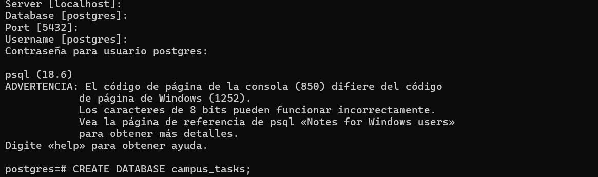

## 2.2 Creación de la base de datos y la tabla

El repositorio no trae ningún script SQL, así que creamos la base a mano desde psql:

```sql
CREATE DATABASE campus_tasks;
\c campus_tasks
CREATE TABLE tareas (id SERIAL PRIMARY KEY, titulo TEXT NOT NULL);
INSERT INTO tareas (titulo) VALUES
 ('Leer la guía de la clase 2'),
 ('Preparar el entorno de desarrollo');
SELECT * FROM tareas;
```

El `\c campus_tasks` es importante porque cambia a la base nueva. Si se omite, la tabla queda en la base equivocada. El `SELECT` final mostró las dos filas iniciales.

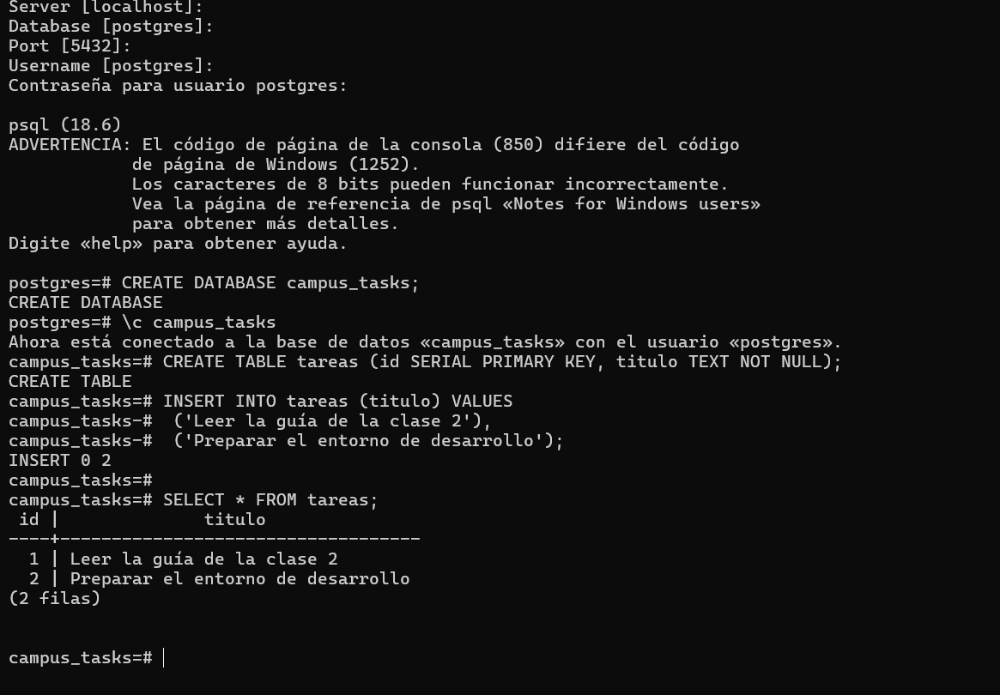

Nota sobre las capturas: en las capturas anteriores a la Figura 16, la palabra «guía» aparece escrita como «gu¡a». Probablemente se debe al aviso de código de página que muestra psql en la Figura 1 (850 frente a 1252), que hace que la consola de Windows interprete distinto los caracteres con tilde. Desde la Figura 16 ya se ve «guía» correctamente.

## 2.3 Archivo `backend/.env`

Creamos `backend/.env` con las variables que usa `DatabaseService`: `DB_HOST`, `DB_PORT`, `DB_USER`, `DB_PASSWORD` y `DB_NAME`. La contraseña no se muestra en este documento. El archivo va dentro de `backend` porque `main.ts` importa `dotenv/config` y dotenv lo busca en la carpeta desde donde se arranca el servidor. No se sube a Git porque ya está en el `.gitignore`, y lo comprobamos con `git status` antes de cada commit de código.

Problema que tuvimos: el primer `.env` quedó vacío. Lo creamos con Notepad pero no se guardó el contenido. El backend arrancó, pero al pedir `/tareas` falló con:

```
Error: SASL: SCRAM-SERVER-FIRST-MESSAGE: client password must be a string
```

Eso quería decir que `DB_PASSWORD` llegaba sin valor. Lo solucionamos reescribiendo el archivo desde la terminal y reiniciando el servidor, porque el `.env` solo se lee al arrancar.

## 2.4 Comprobación del backend

Dentro de `backend` ejecutamos `npm ci` y `npm run start:dev`.

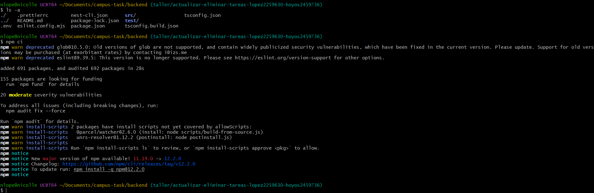

El servidor arrancó y registró las rutas de `/tareas`.

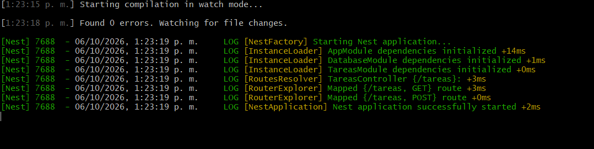

En `http://localhost:3000/tareas` apareció el JSON con las dos tareas iniciales.

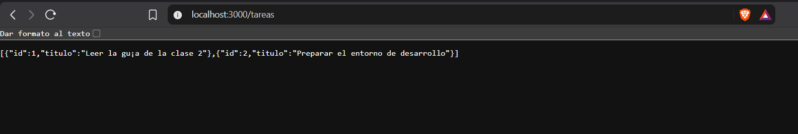

## 2.5 Comprobación del frontend

Dentro de `frontend` ejecutamos `npm ci` y `npm start`.

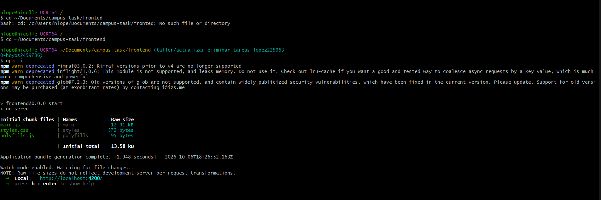

En `http://localhost:4200` aparecieron las tareas y probamos Agregar con una tarea nueva, que se mostró en la lista.

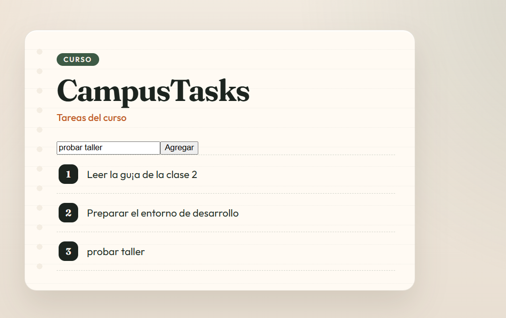

## 2.6 Pruebas de ejemplo

- Backend: `npm test` dio `Test Suites: 2 passed` (`tareas.service.spec.ts` y `tareas.integration.spec.ts`).
- Frontend: al correr `npm test`, Karma mostró `Cannot start Chrome` porque no encontraba Chrome (nosotros usamos Brave). Instalamos Google Chrome, volvimos a ejecutar y pasaron las pruebas.

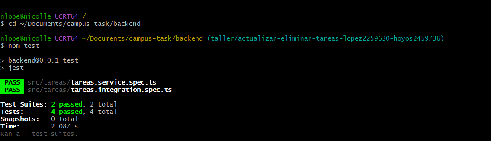

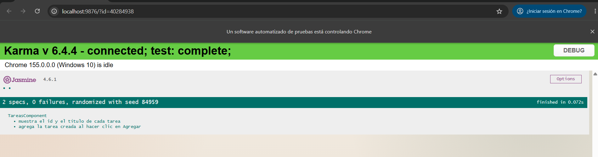

# 3. Lectura de los ejemplos

Antes de programar leímos las pruebas que ya trae el repositorio, porque las nuestras tenían que seguir el mismo patrón.

`tareas.service.spec.ts` (prueba unitaria). Crea un módulo de prueba con `TareasService` y cambia el `DatabaseService` real por un objeto falso (mock) cuyo método `query` es un `jest.fn()`. En cada prueba se le dice qué devolver con `mockResolvedValue`, se llama directamente al método del servicio y se revisa el valor que devuelve y los argumentos exactos con que se llamó a `query` (el SQL y los parámetros). Por eso no hace falta una base de datos real.

`tareas.integration.spec.ts` (prueba de integración). Monta el controlador, el servicio y el `DatabaseService` simulado. Con `supertest` hace una petición HTTP al controlador y verifica el código de estado, el cuerpo de la respuesta y los argumentos que recibió `query`. Esta prueba comprueba la ruta y el código HTTP, cosa que la unitaria no hace.

`tareas.component.spec.ts` (prueba de componente). Usa Jasmine y Karma. Monta `TareasComponent` y cambia el servicio HTTP por un spy, que es un objeto falso que registra con qué argumentos lo llamaron y devuelve lo que la prueba le indique (con `of(...)`). Simula clics y revisa lo que aparece en pantalla, sin necesitar el backend encendido.

Patrón que reutilizamos: preparar, ejecutar, verificar.

| Paso | Backend | Frontend |
|---|---|---|
| Preparar | Definir qué devuelve `query` | Configurar lo que devuelve el spy y renderizar la lista inicial |
| Ejecutar | Llamar al método o hacer la petición con `supertest` | Escribir en el campo y hacer clic en los botones |
| Verificar | Resultado, código de estado y argumentos de `query` | Argumentos del spy y lo que se ve en pantalla |

# 4. Implementación

## 4.1 Backend

Servicio (`tareas.service.ts`). Copiamos la idea de `crear` y agregamos dos métodos:

| Operación | Método | SQL |
|---|---|---|
| Actualizar | `actualizar(id: number, titulo: string): Promise<Tarea>` | `UPDATE tareas SET titulo = $1 WHERE id = $2 RETURNING id, titulo` |
| Eliminar | `eliminar(id: number): Promise<Tarea>` | `DELETE FROM tareas WHERE id = $1 RETURNING id, titulo` |

Los dos usan consultas parametrizadas (`$1`, `$2`) y no pegamos los valores dentro del texto SQL. Lo hicimos porque el taller lo exige y porque, si se concatena lo que escribe el usuario, alguien podría meter SQL malicioso (inyección SQL). Con parámetros, la base de datos trata esos valores solo como datos. Usamos `RETURNING id, titulo` para que la base nos devuelva la fila que cambió o borró sin hacer otra consulta aparte.

Controlador (`tareas.controller.ts`). Agregamos las rutas `PATCH /tareas/:id` (recibe `{ "titulo": "..." }`) y `DELETE /tareas/:id`. El taller nos pedía tomar y justificar dos decisiones:

Decisión 1: ¿cómo pasamos el `:id` de texto a número?
El id llega desde la URL como texto (`"3"`), pero el servicio lo recibe como `number`. Usamos `ParseIntPipe` de NestJS en `@Param('id', ParseIntPipe)`. Lo elegimos porque:
- Hace la conversión solo, sin escribir código a mano.
- Valida la entrada: si alguien escribe `/tareas/abc`, NestJS responde `400 Bad Request` y la consulta nunca llega a la base. Si hubiéramos usado `Number("abc")` nos daría `NaN` y PostgreSQL tiraría un error 500, que se ve peor y no explica qué pasó.

Decisión 2: ¿cómo sabemos que la tarea no existe para responder 404?
Aprovechamos el `RETURNING`. Si el id no existe, el `UPDATE` o el `DELETE` no afecta ninguna fila, la base no devuelve nada y `resultado.rows[0]` queda `undefined`. El servicio devuelve eso tal cual, y en el controlador revisamos `if (!tarea)` y lanzamos `NotFoundException`, que NestJS convierte en un 404. Lo elegimos porque:
- Usa una sola consulta. La otra opción era hacer un `SELECT` primero para ver si existe y luego el `UPDATE`, pero son dos consultas y, en medio, otra persona podría borrar la tarea.
- Cada pieza hace lo suyo: el servicio habla con la base de datos y el controlador decide qué código HTTP responder.

Así quedó el controlador:

```typescript
@Patch(':id')
async actualizar(
  @Param('id', ParseIntPipe) id: number,
  @Body('titulo') titulo: string,
): Promise<Tarea> {
  const tarea = await this.tareasService.actualizar(id, titulo);
  if (!tarea) {
    throw new NotFoundException(`No existe la tarea con id ${id}`);
  }
  return tarea;
}

@Delete(':id')
async eliminar(@Param('id', ParseIntPipe) id: number): Promise<Tarea> {
  const tarea = await this.tareasService.eliminar(id);
  if (!tarea) {
    throw new NotFoundException(`No existe la tarea con id ${id}`);
  }
  return tarea;
}
```

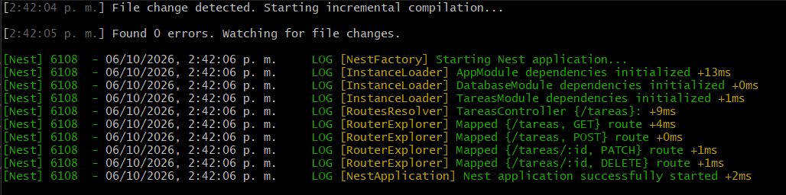

Prueba manual del backend con la base real. Con el backend y PostgreSQL corriendo probamos con `curl` desde la terminal:

1. `POST /tareas` creó una tarea de prueba (id 4).
2. `DELETE /tareas/4` respondió 200 con la tarea eliminada.
3. Repetimos el mismo `DELETE` y respondió 404 con el mensaje `No existe la tarea con id 4`.

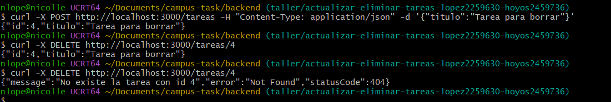

## 4.2 Frontend

Servicio HTTP (`tareas.service.ts`). Agregamos dos métodos parecidos al que crea tareas, y ambos devuelven `Observable<Tarea>`:
- `actualizar(id, titulo)` envía `PATCH /tareas/:id` con `{ titulo }`.
- `eliminar(id)` envía `DELETE /tareas/:id`.

Componente (`tareas.component.ts` y `tareas.component.html`). Cada tarea ahora tiene los botones Editar y Eliminar. Usamos un signal llamado `editandoId` para saber qué fila está en edición:
- Modo normal: se ve el título con los botones Editar y Eliminar.
- Modo edición: esa fila cambia a un campo de texto con el título actual y los botones Guardar y Cancelar (el Cancelar lo agregamos nosotros para poder salir sin guardar). Las demás filas no cambian.

Una regla importante del taller era que la lista solo cambie cuando el backend responde con éxito. Por eso actualizamos la lista dentro del `next` del `subscribe`, cuando llega la respuesta, y no antes de llamar al servicio. Si lo hiciéramos antes, la pantalla podría mostrar algo que en la base de datos nunca pasó. Al guardar se reemplaza solo la tarea editada por la que devolvió el backend, y al eliminar se quita solo esa tarea.

¿Qué pasa en pantalla si hay un error?

| Caso | Qué hace la pantalla |
|---|---|
| El backend responde 404 (por ejemplo, otra persona ya borró esa tarea) | No tocamos la lista por nuestra cuenta. Mostramos "La tarea ya no existe. Se actualizó la lista." y volvemos a pedir la lista al backend para que quede igual que la base de datos. |
| Cualquier otro error (por ejemplo, el backend está apagado) | Mostramos "No se pudo guardar/eliminar la tarea. Intenta de nuevo." y la lista se queda como estaba. |

Prueba manual completa en `http://localhost:4200` (con el backend y la base reales):

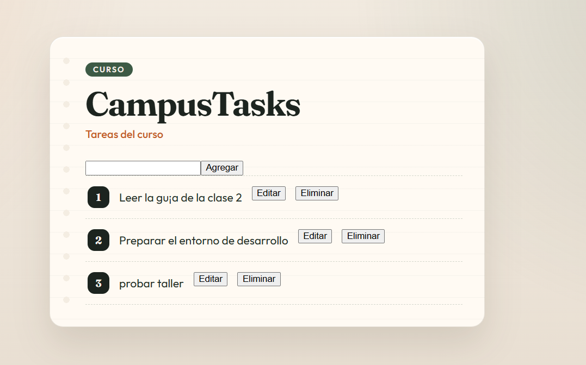

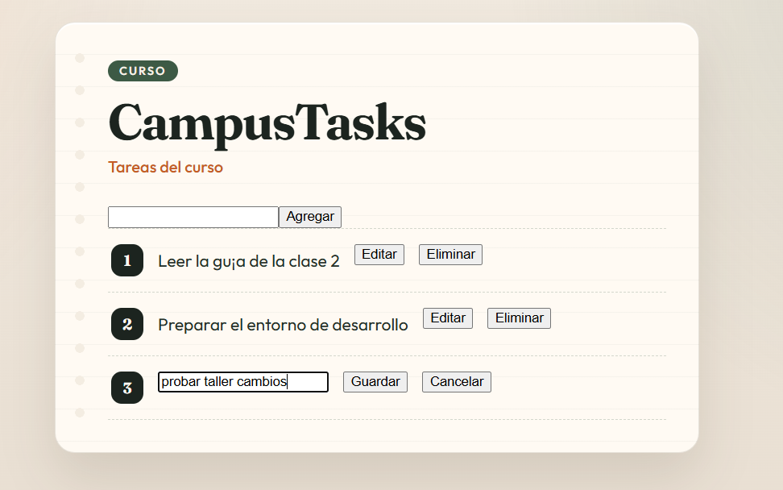

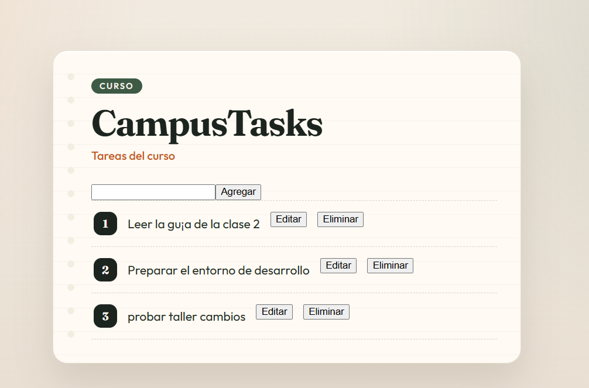

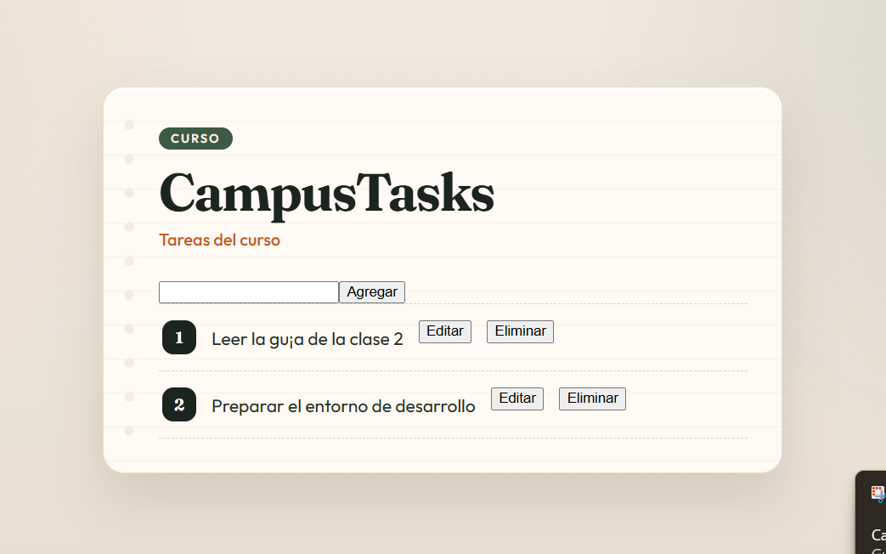

Para confirmar que lo que se ve en pantalla coincide con la base, agregamos una tarea más desde la interfaz («prueba final taller») y consultamos `GET /tareas`:

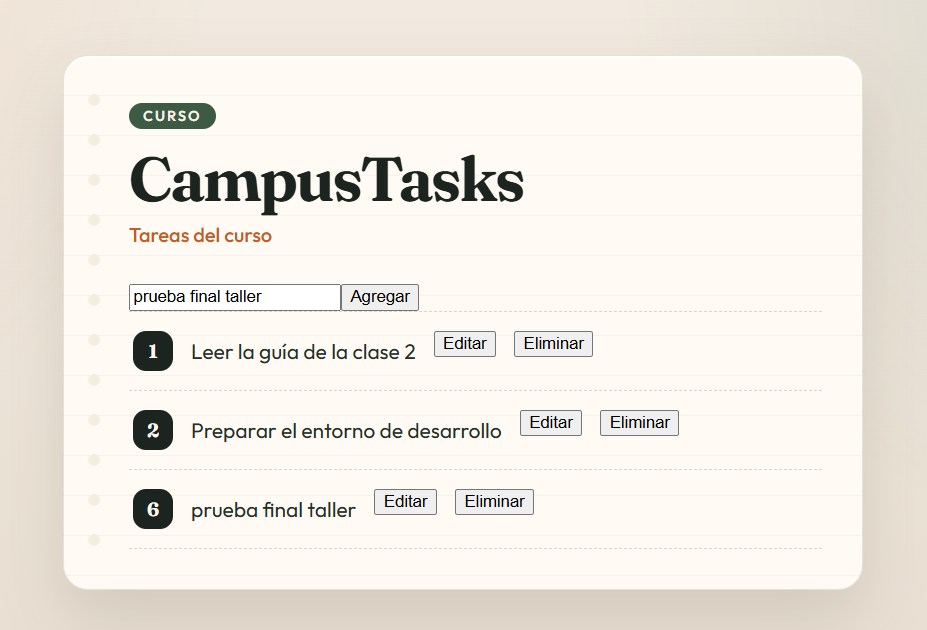

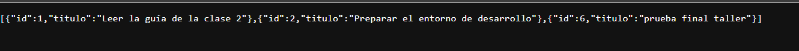

Prueba del 404 en la interfaz. Creamos una tarea para esta prueba («error 404», id 7).

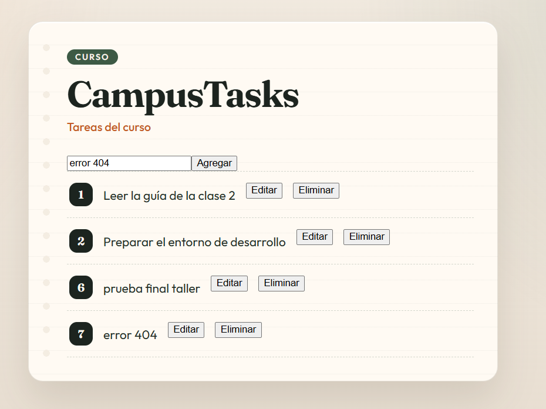

Abrimos la aplicación en dos pestañas. En la primera eliminamos la tarea «error 404» y en la segunda, que todavía la mostraba, pulsamos Eliminar sobre esa misma tarea. Apareció el mensaje de 404 y la lista se refrescó.

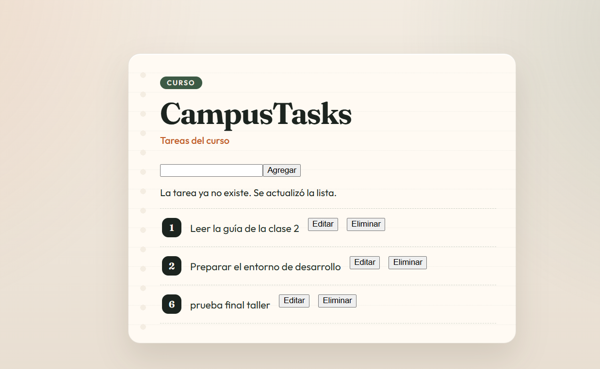

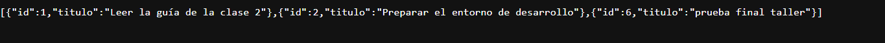

# 5. Pruebas

Seguimos el mismo patrón de las pruebas de ejemplo (preparar, ejecutar, verificar) y agregamos las pruebas nuevas en los mismos archivos.

## 5.1 Qué cubre cada prueba nueva

| Tipo | Archivo | Caso | Qué verifica |
|---|---|---|---|
| Unitaria | `tareas.service.spec.ts` | `actualizar` | `query` se llamó con el UPDATE, el título y el id; el método devuelve la fila |
| Unitaria | `tareas.service.spec.ts` | `eliminar` | `query` se llamó con el DELETE y el id; devuelve la fila eliminada |
| Integración | `tareas.integration.spec.ts` | PATCH existente | Envía el título; responde 200 con la tarea actualizada; argumentos de `query` correctos (el id llega como número, no como texto) |
| Integración | `tareas.integration.spec.ts` | PATCH inexistente | `query` devuelve `rows: []` y la ruta responde 404 |
| Integración | `tareas.integration.spec.ts` | DELETE existente | Responde 200 con la tarea eliminada; argumentos de `query` correctos |
| Integración | `tareas.integration.spec.ts` | DELETE inexistente | `query` devuelve `rows: []` y la ruta responde 404 |
| Componente | `tareas.component.spec.ts` | Editar | Clic en Editar, escribir un título y Guardar: el spy recibe el id y el título nuevo, la pantalla muestra el cambio y la otra tarea no cambia |
| Componente | `tareas.component.spec.ts` | Eliminar | Clic en Eliminar: el spy recibe el id de esa tarea, esa tarea desaparece y las demás siguen visibles |

Las pruebas anteriores (listar y crear en el backend, listar y agregar en el frontend) no se tocaron y siguen pasando. Para las pruebas nuevas del frontend hicimos un segundo bloque `describe` con dos tareas y los cuatro métodos en el spy, porque con una sola tarea no se podía comprobar que "las demás siguen visibles".

## 5.2 Resultados

Backend (`npm test` en `backend`): 2 suites aprobadas y 10 pruebas aprobadas (4 unitarias y 6 de integración).

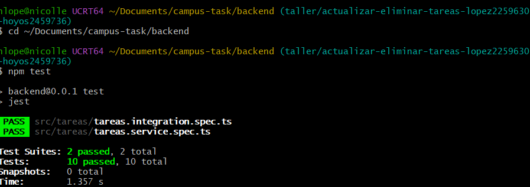

Frontend (`npm test` en `frontend`, con Chrome): 4 specs, 0 failures (las 2 anteriores sin cambios y las 2 nuevas).

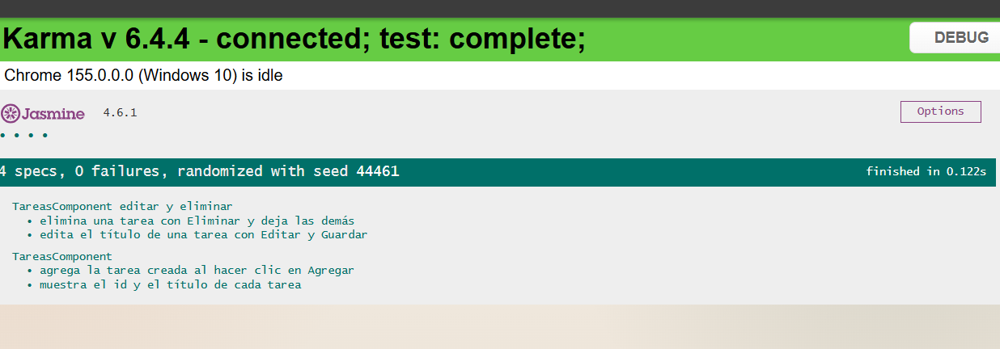

# 6. Git

Comandos que usamos:

```bash
git clone https://github.com/TevenV27/campus-task.git
cd campus-task
git checkout master
git pull
git checkout -b taller/actualizar-eliminar-tareas-lopez2259630-hoyos2459736
git push -u origin taller/actualizar-eliminar-tareas-lopez2259630-hoyos2459736
git status                                  # confirmamos que .env no aparece
git add backend/src/tareas/
git commit -m "se agrega actualizar y eliminar tareas en el backend con pruebas unitarias y de integración"
git push
git status                                  # confirmamos que .env no aparece
git add frontend/src/
git commit -m "se agrega editar y eliminar tareas en el frontend con pruebas de componente"
git push
git add ENTREGA.md capturas/
git commit -m "se agrega documento ENTREGA con la sustentación del taller"
git push
```

No hicimos commits en `master`. Agregamos los archivos por carpeta (sin `git add .`) para no subir cosas por accidente, y antes de cada commit de código revisamos `git status` para confirmar que `.env` no aparecía.

- URL de la rama: https://github.com/TevenV27/campus-task/tree/taller/actualizar-eliminar-tareas-lopez2259630-hoyos2459736
- Commit del backend: `6a9d3f4`
- Commit del frontend: `ed0486a`

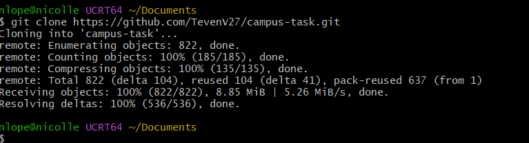

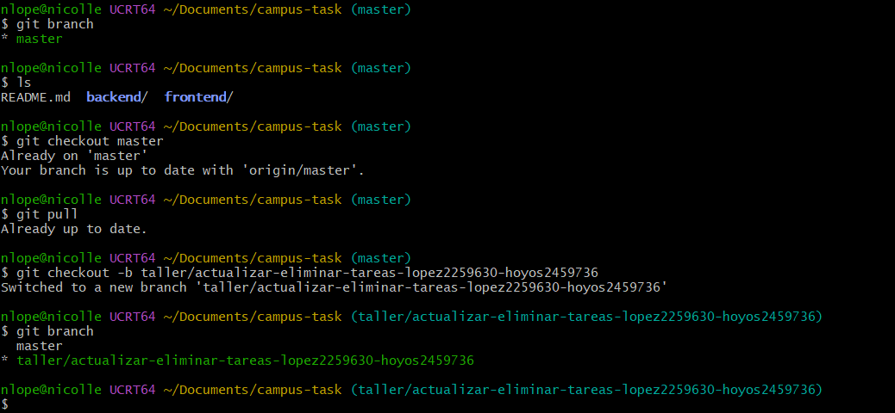

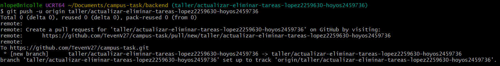

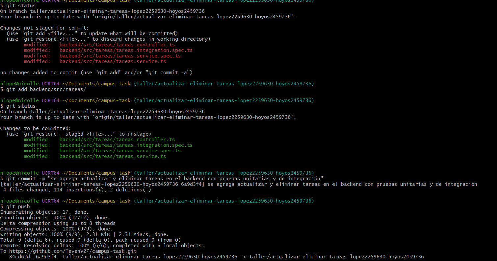

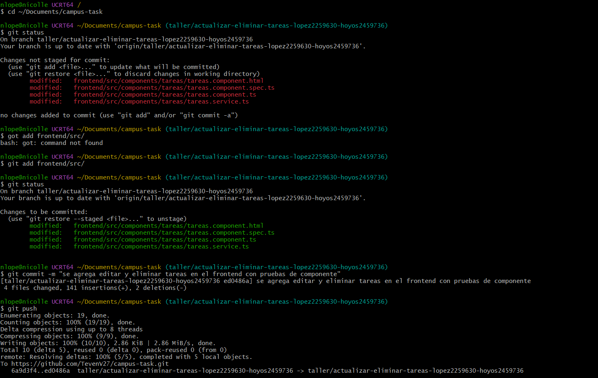
